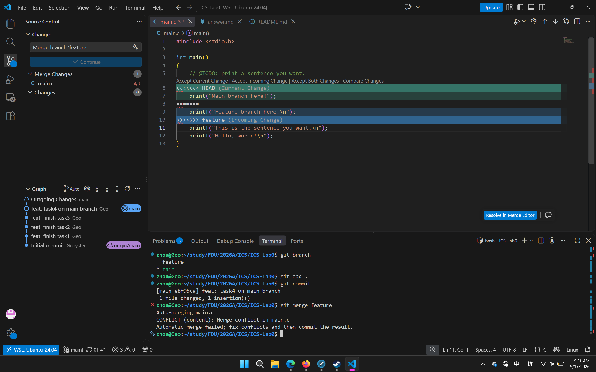
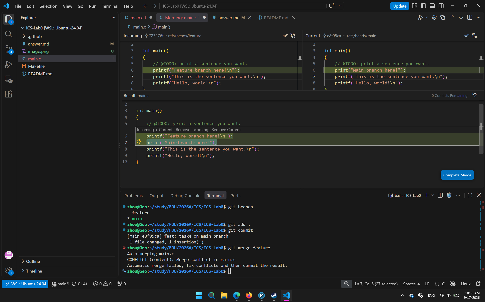
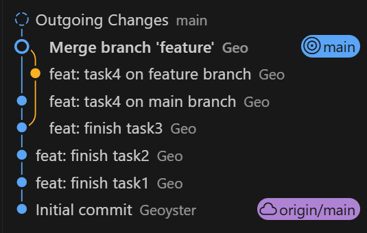

## 1.

- 有，git。
- 每次提交可以选择本地改动的一部分，而不是总是全部修改，这样可以让每一个改动尽可能独立，便于后续的回滚等操作。
- `git branch` 只显示本地所有分支，`git branch -a` 显示本地和远程跟踪所有分支。 

## 3. 

[Commit Message 规范](https://www.ruanyifeng.com/blog/2016/01/commit_message_change_log.html) 讲述了规范化 commit message 的意义，并且给出 Angular 规范下的具体写法及实例，最后提供辅助撰写规范的 commit message 以及审查的工具。

[Git Flow 分支控制](https://www.dafaycoding.com/article/git-gif-flow) 讲述了经典的 gitflow 的形式及流程，以避免代码冲突和版本问题。

[语义化版本](https://semver.org/lang/zh-CN/) 讲述了依照 RFC 2119 规范的版本语义设计，并且对版本控制的意义进行阐述，由此进一步回答一些版本控制上的常见问题。

在我看来，学习Git有以下几个重要的意义：

- Git利于代码的开发迭代。通过Git可以监控项目的进展，通过不同的分支管理可以聚焦某一模块进行开发。
- Git是团队协作的重要工具，在项目中，熟练、规范地使用Git可以大大加快团队协作的效率，更重要的是，当项目代码的复杂度成指数级上升时依然可以高效的对代码进行管理，提高开发效率。
- Git是重要的安全保障。配合Github等远程代码托管平台，我们可以轻松地完成对代码的备份和实时跟踪。如果本地设备发生故障或对代码进行了不可逆的改动，Git是恢复原始数据的重要工具
- Git是程序员世界里共通的交流语言，通过Git配合代码托管平台，我们可以阅读他人上传的高质量代码，可以通过提交issue/fork/branch的方式为社区添砖加瓦，乃至于自己作为开发者开源自己的代码，促进社区的良性发展

## 4.

遇到冲突：

解决中：

完成：

